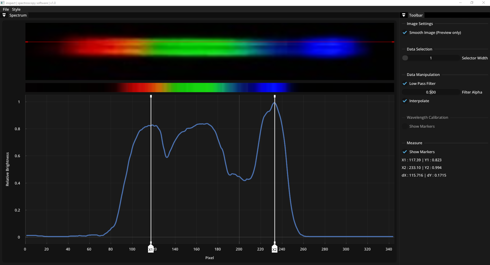

# inspect
inspect is spectroscopy software for plotting and measuring spectra using [SFML](https://github.com/SFML/SFML), [Dear ImGui](https://github.com/ocornut/imgui) and [ImPlot](https://github.com/epezent/implot)



## Features
- Show spectrum from image file
- Image manipulation (ToDO)
- Extract significant spectrum portion
- Plot spectrum as brightness curve
- Data interpolation and low pass filtering
- Measuring using drag sliders
- Wavelength calibration with known spectral lines (ToDo)
- Correction for wavelength dependend refraction (ToDo)

## How to use
Open ```inspect.exe``` and open your image file using ```File > Open```. 
